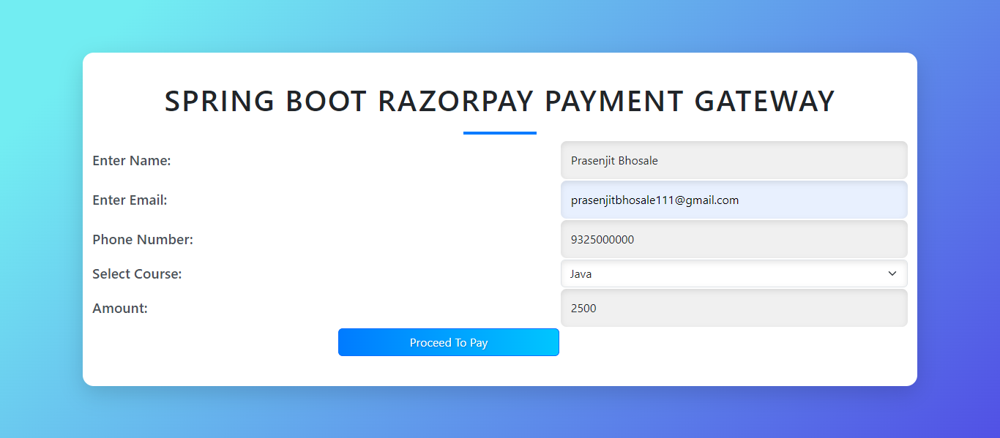
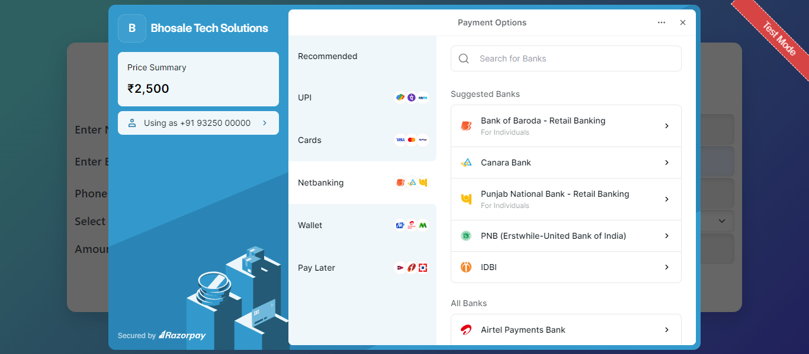
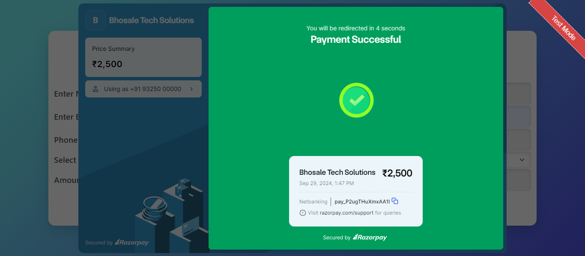

# SpringBoot Razorpay Payment Gateway

## Overview

This project demonstrates the integration of Razorpay's payment gateway with a Spring Boot web application. The system allows users to make online payments, with the transaction details being managed and stored in a MySQL database. The project employs REST API services to handle order creation, payment verification, and includes callback handling to confirm transaction status.

The frontend is built with HTML, CSS, and JavaScript, while the backend is implemented using Spring Boot, Spring JPA for database interaction, and Razorpay's Java API for payment integration.

## Features

- **Payment Integration with Razorpay:** Users can create orders and make payments.
- **Order Management:** Creation of new orders via a REST API.
- **Payment Callback Handling:** Razorpay sends a callback after payment, which the application processes and verifies.
- **Database:** Uses JPA to store and update transaction details in MySQL.
- **Frontend:** HTML, CSS, and JavaScript to handle user interactions and payments.
- **Validation:** Ensures secure and proper order/payment processing.

## Screenshots

Here are some screenshots of the application:

- **Payment Gateway Home**  

- **Razorpay Dashboard**  
  

- **Payment Successful Razorpay**  
    

- **MySQL Database View**  
  

- **Spring Boot Configuration**  
  

## API Endpoints

- `GET /`: Displays the homepage (a simple HTML form for initiating a payment).
- `POST /create-order`: Creates a new Razorpay order and returns the order details in JSON format.
- `POST /handle-payment-callback`: Processes the Razorpay payment callback to verify the transaction and update the order status in the database.

## Technologies Used

- **Backend**: Spring Boot, Spring JPA, Razorpay Java API
- **Frontend**: HTML, CSS, JavaScript
- **Database**: MySQL
- **API Testing**: Postman

## How to Run

1. Clone the repository.
2. Configure the `application.properties` file with your MySQL and Razorpay credentials.
3. Build and run the Spring Boot application.
4. Access the application at `http://localhost:8080`.

---

